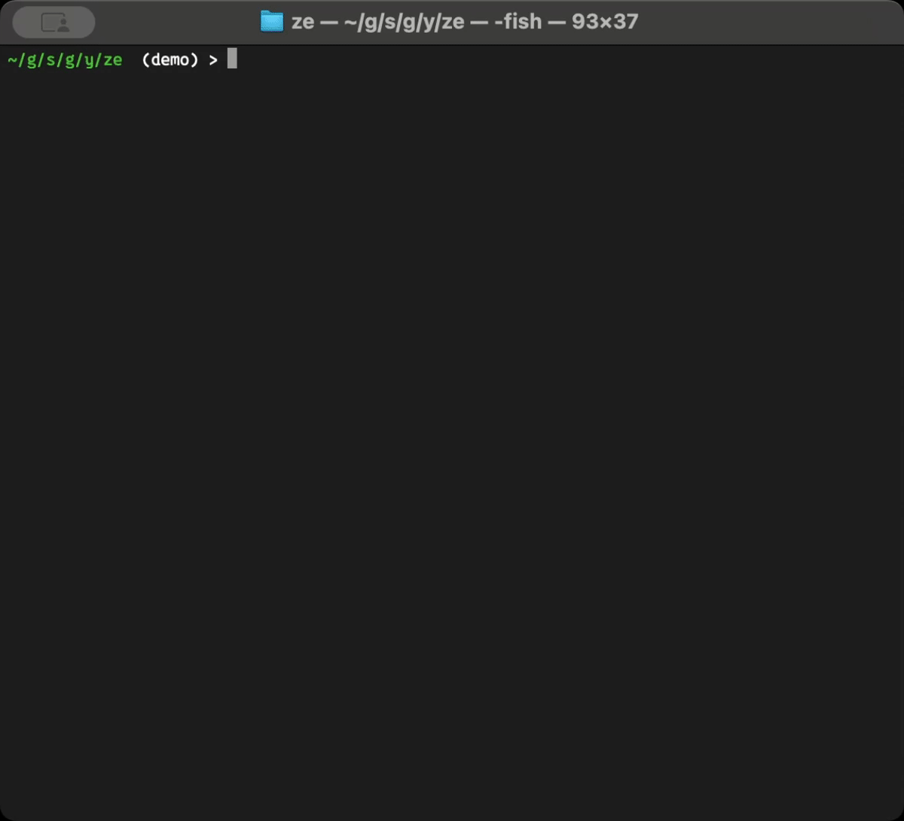

# Ze - Zellij Session Manager

Fast and intuitive Zellij session manager with real-time search. Simplify your Zellij workflow with intuitive keyboard-driven operations.



## Installation

```bash
# Install from npm
npm install -g ze-cli

# Or using npx
npx ze-cli
```

### Install from source

```bash
# Clone the repository
git clone https://github.com/yudppp/ze.git
cd ze

# Install dependencies
npm install

# Install globally
npm link
```

## Usage

```bash
# Run ze
ze
```

### Features

#### Smart Session Management
- **Real-time Search**: Incremental search with instant filtering
- **Create from Search**: Type any name to get "Create New Session" option
- **Always Available**: "Create New Session" option always shown at bottom
- **Layout Selection**: Choose from available layouts when creating sessions
- **Session Actions**: View, attach, delete, and create sessions seamlessly

#### Enhanced User Experience  
- **Simplified State**: Clean 3-mode interface (list → input → layout)
- **Keyboard-First**: Optimized for terminal workflow
- **Visual Feedback**: Active sessions marked with green dot (●)
- **No Dependencies**: Minimal runtime dependencies for fast startup

## Keyboard Shortcuts

- **Navigation**
  - `↑`/`↓` - Navigate through items
  - `Enter` - Select item or confirm input
  - `Esc` or `Ctrl+C` - Cancel current action or exit

- **Search & Creation**
  - Type any characters - Filter sessions by name (incremental search)
  - `Backspace`/`Delete` - Clear search character by character
  - Search for non-existent name - Shows "Create New Session: [name]" option

- **Session Management**
  - `Ctrl+D` - Delete selected session

## User Interface

### Session Selection
```
⚡ Select Session
┌─────────────────────────────────────┐
│   session1                          │
│ > session2 ●                        │
│   [ + New Session ]                 │
└─────────────────────────────────────┘
```

### Search with Create Option
```
⚡ Select Session
Search: my-project
┌─────────────────────────────────────┐
│ > Create New Session: my-project    │
└─────────────────────────────────────┘
```

### Simplified Session Creation
1. **Name Input**: Enter session name (optional, press Enter to continue)
2. **Layout Selection**: Choose from available layouts
   - `default` - Standard layout (recommended)
   - `compact` - Compact view  
   - `classic` - Classic style
   - Custom layouts from `~/.config/zellij/layouts/`

## Development

```bash
# Watch mode for TypeScript
npm run dev

# Build
npm run build

# Run
npm start
```

## License

MIT
